# PINN-VIZ

This is a visualization system program for PINN (Physics-informed neural network) surrogate model. Users could use this tool to create and train their PINN models here.

## Introduction

TechStack: Flask (python), Javascript (jquery, d3, plotly), TensorFlow.

### Run code

'flask run' in root directory.

Welcome to Flask: https://flask.palletsprojects.com/en/2.2.x/.

### Manual

Demo video: https://www.youtube.com/watch?v=cDsAVo_EAo4.

#### Overview of the system

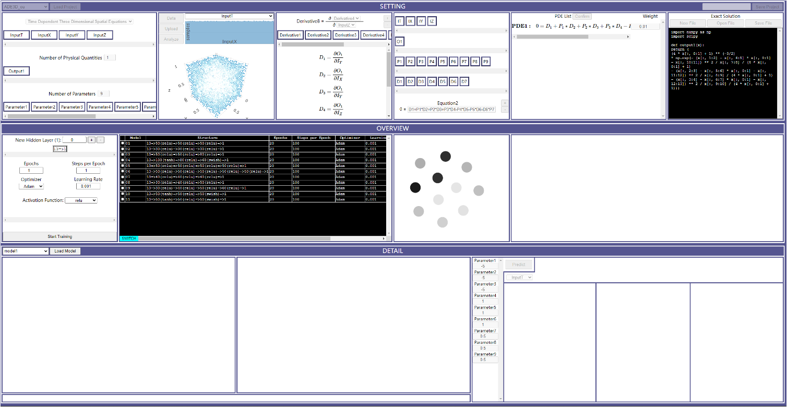

#### Step 1.1:

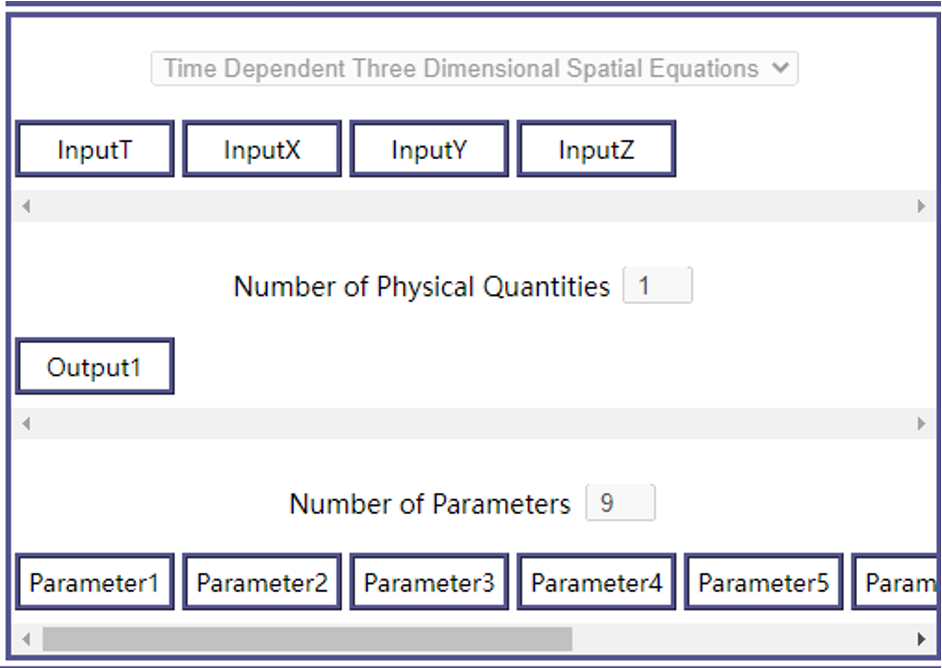

1. Select the type of equations.
2. Set number of Outputs.
3. Set number of Parameters.

#### Step 1.2:

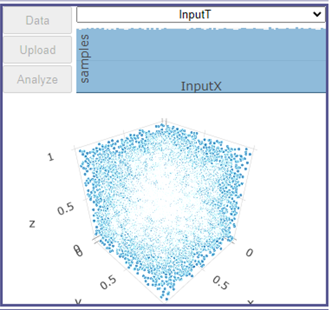

1. 'Data' button to select the local '.csv' file.
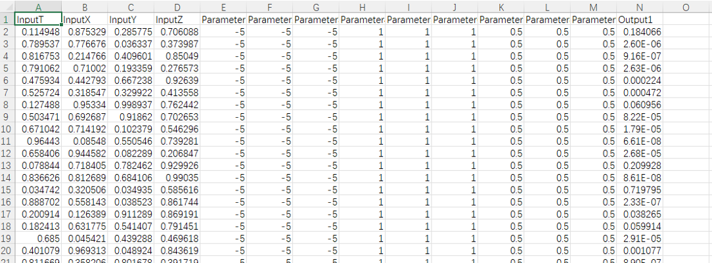
2. 'Upload' button to check if the file is valid and then upload.
3. 'Analyze' button to show the distribution of the data.

#### Step 1.3:

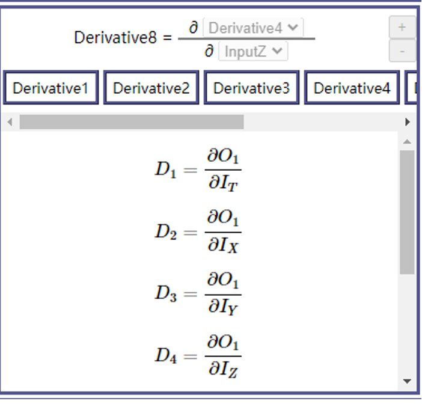

Use outputs/inputs/lower order derivative term to make higher order derivative term

#### Step 1.4:

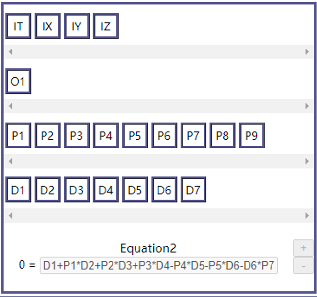

Make PDE(s)

#### Step 1.5:

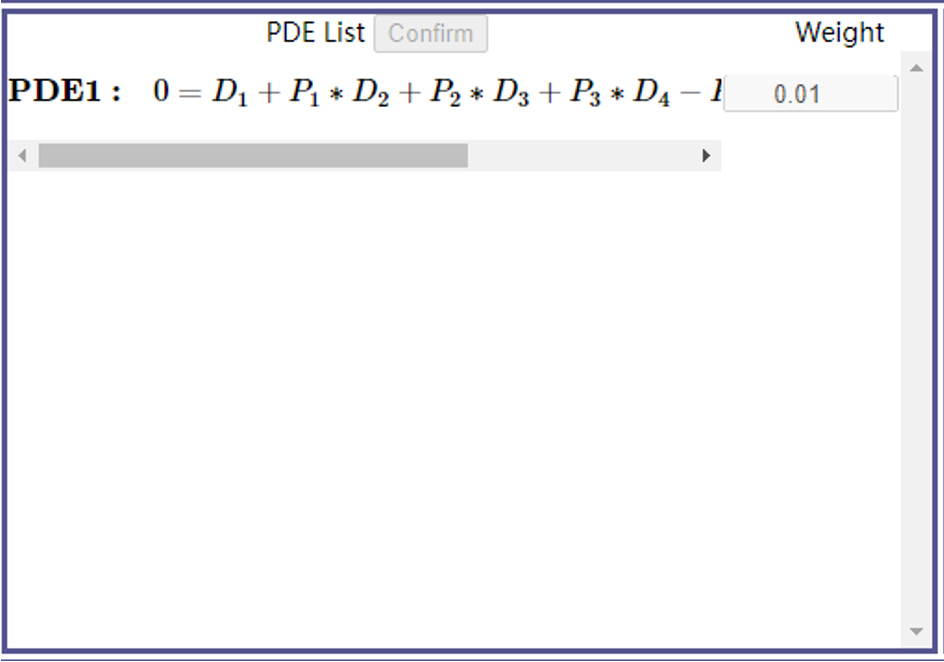

Set weights on PDE(s)

#### Step 1.6:

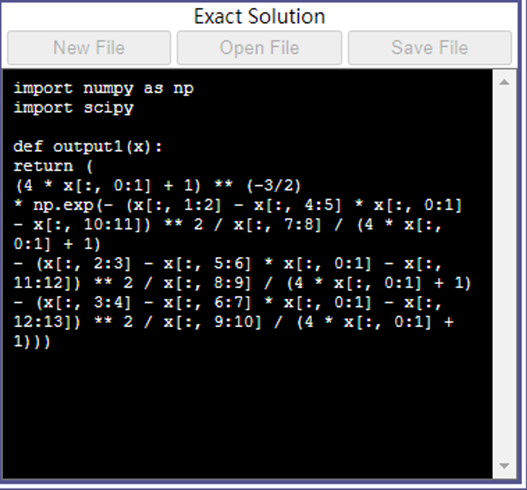

Set exact solution for later comparison. (optional)

#### Step 2.1:

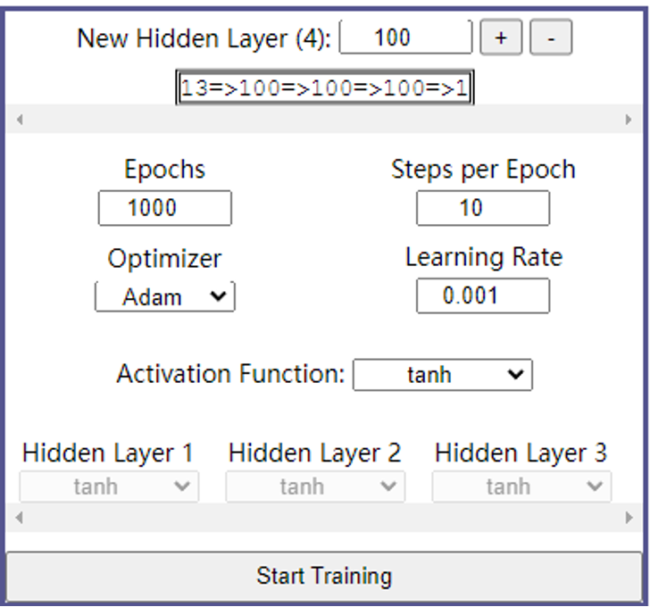

1. Add/delete layer by setting the number of neurons, to change the structure of networks.
2. Define the epochs / batches / optimizer / learning rate and activation function for each layer.

#### Step 2.2:

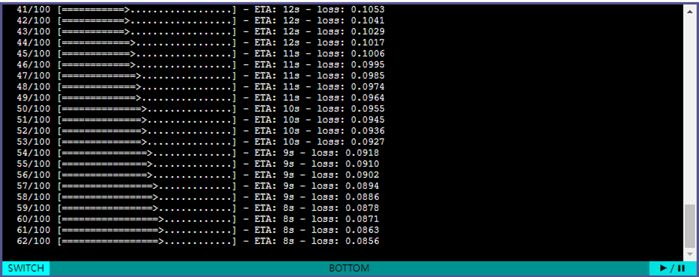

Terminal style window to show the training process.

'Switch' Button

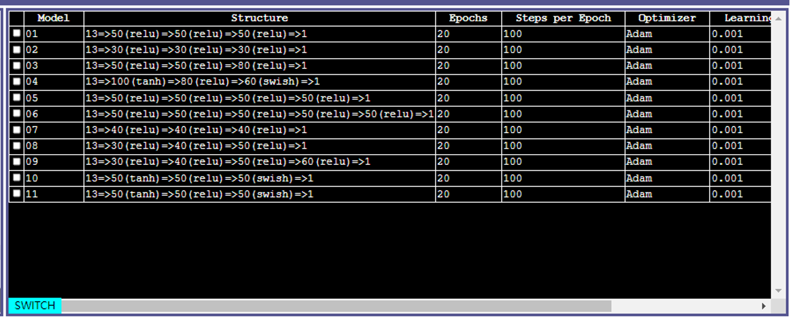

Information of the exiting trained model in database.

#### Step 2.3

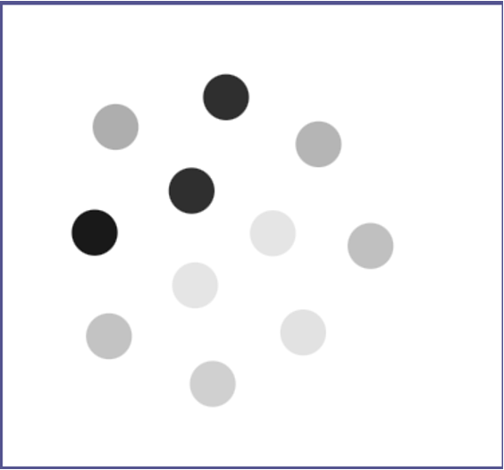

Show the 2D mapping result with TSNE dimensionality reduction for structures (position). Color shows the final loss value (the darker the smaller).

#### Step 2.4:

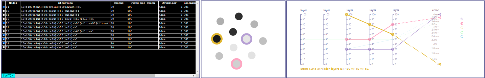

1. Check the checkbox in the database to add the model structure and final loss into the parallel chart comparison.
2. Mouseover or click on the model while highlight them in the parallel chart and 2D mappings with the same color.

#### Step 3.1:

Choose a certain model.

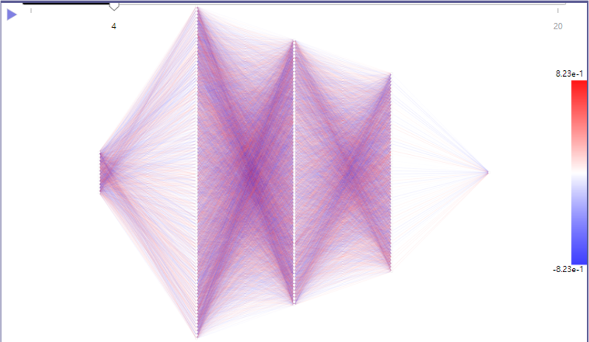

Structure visualization (network style)

'Switch' Button

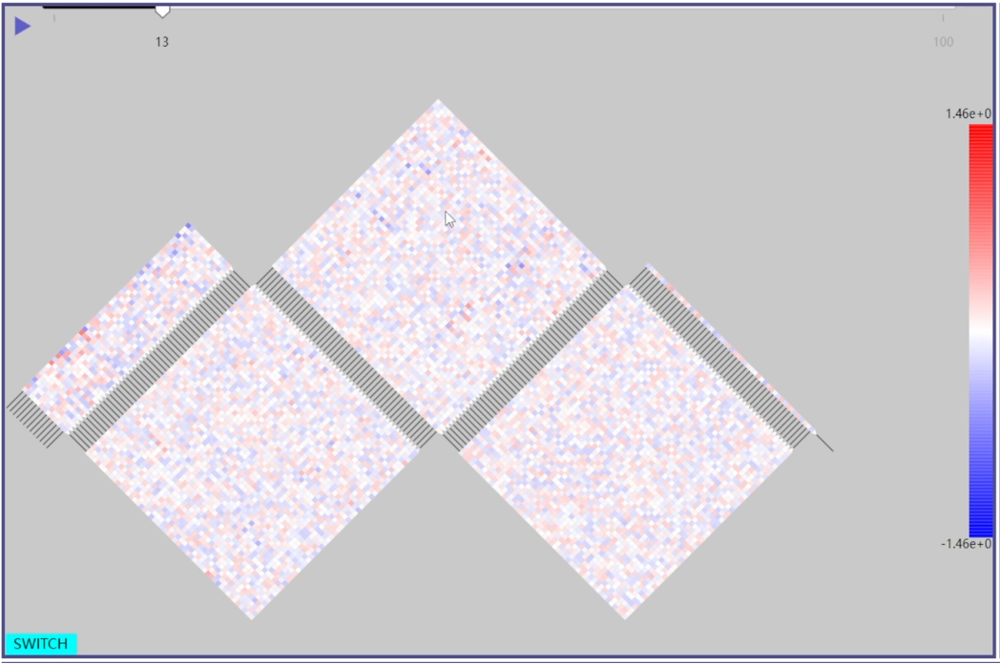

Structure visualization (matrix style)

#### Step 3.2:

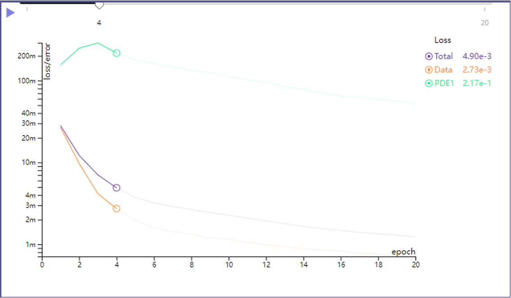

Loss(es) change.

#### Step 3.3:

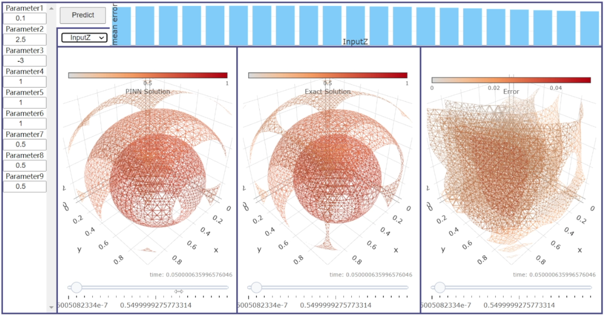

Set parameters to make the PINN surrogate model predict, and then compare with exact solution.

